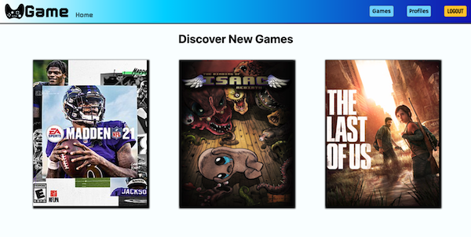
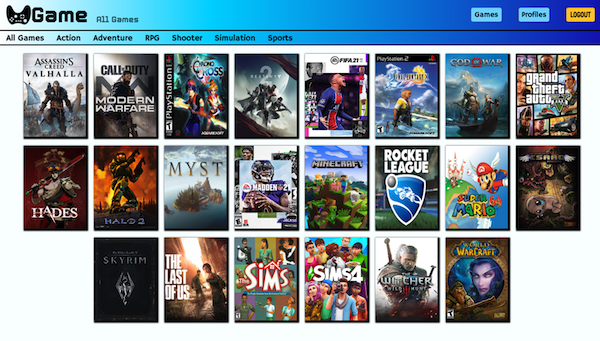
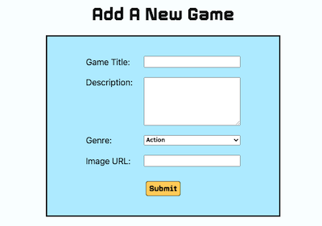
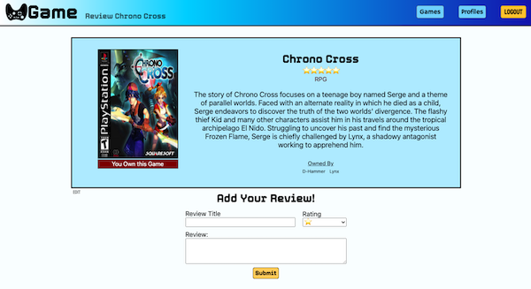
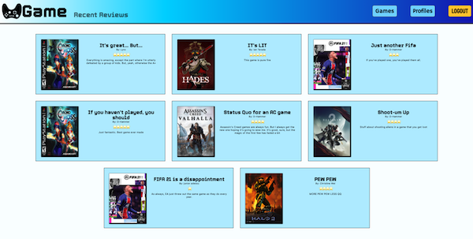
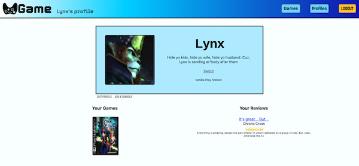

# U-Game #

## Launch App ##

https://u-game-unit-2-project.herokuapp.com/

## What is it? ##

U-Game is a site that you can browse video games from! Inside the site you can create a profile to add games you own from a crowd sourced list of games. 

Home 

All Games 

### Don't see a game on the list? 
That's okay, you can go to the "Add a Game" page to create the missing game! 

### Did you love/hate a specific game?
Tell everyone why by creating a review! 

### Want to see what people are talking about? 
Navigate to the "Recent Reviews" page to see most recent to oldest reviews created! 

### Create a Profile!
In your profile page feel free to update your Name, Profile Picture, Twitch Link, Bio, and consoles you own. You can even add a Gamer Tag for each console if you would like to connect with others online!

Don't forget to check out other people's profiles on the "All Profiles" page, so you can see what games they own and reviews they've made! 

### Don't let that mistake get you down!
Did you mess up your review? Or does the image you used for a game not look right? No Problem! Hit that nifty "Edit" button! Don't worry, only you can edit your reviews.

## Ice Box
* Delete Owned Games
* Add @media for multiple views starting with mobile
* Add search functionality
* Dark Mode
* Add Friends
* Refactor/cleanup Code

## Tech Used:
* HTML
* CSS
* JavaScript
* EJS
* MongoDB
* Mongoose
* Express
* Express-session
* Google Oauth
* Passport
* Dotenv
* Method-override
* Morgan

## Credits:

Icons made by <a href="https://www.freepik.com" title="Freepik">Freepik</a> from <a href="https://www.flaticon.com/" title="Flaticon">www.flaticon.com</a>

### Want to see the creative process?
https://whimsical.com/ugame-9n6KRUJVCnzFqnXqVmnhaD 

